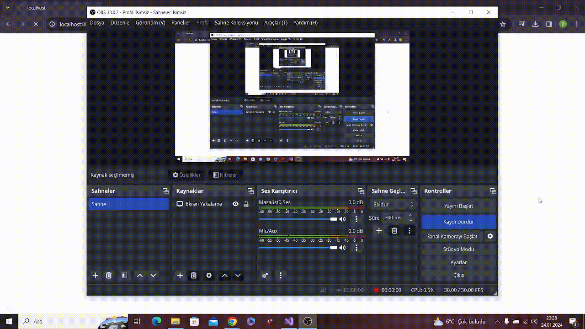

# cpp-htmllocalserver
This project allows you to create localhost.

```cpp
 Line 22  	cout << " Başlatılamadı.";    ----  cout << " Failed to initialize."; 
 Line 29     cout << "Soket oluşturulamadı.";      ----  cout << "Failed to create socket.";
 Line 40      cout << "Soket bağlanamadı";    ----  cout << "Socket could not be connected";
 Line 44      cout << " Sunucu Dinlenemiyor"; ---- cout << "Unable to Listen to Server";
 Line 52 	     cout << "Kabul Edilemedi";    -----  cout << "Not Accepted";
 Line 59   	cout << "İstemci isteği okunamadı"; ---- cout << "Failed to read client request";
 Line 63  string response = "<html><h1> Sunucu</h1><html>"; ---- string response = "<html><h1> Server</h1><html>";
 Line 74 	cout << "Yanıt gönderilemedi"; ----- cout << "No response sent";
 Line 80 cout << " Uygulamaya Yanıt Gönderildi."; ----  cout << "Response Sent to Application.";
 ```
localhost:8000

 

